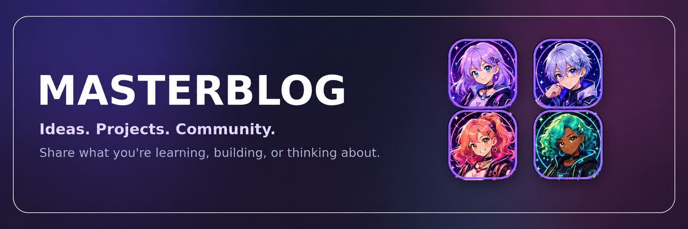
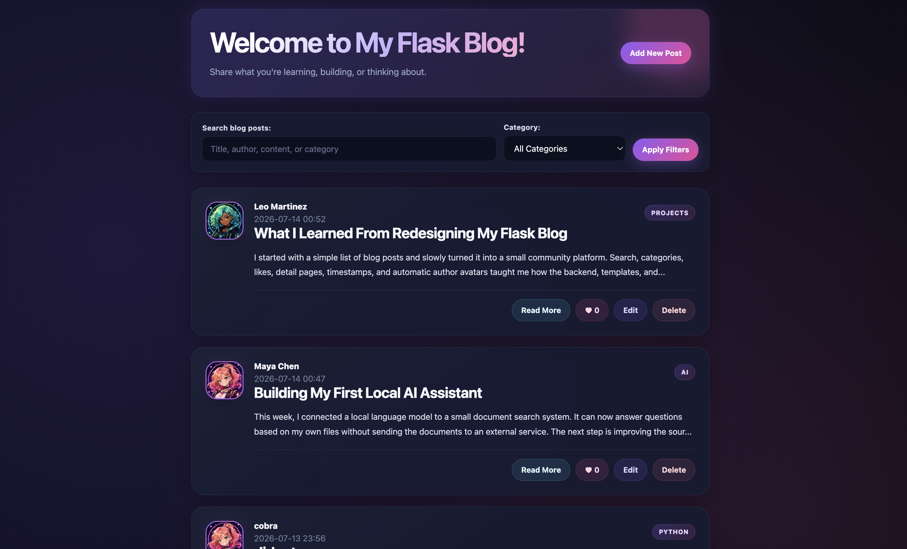
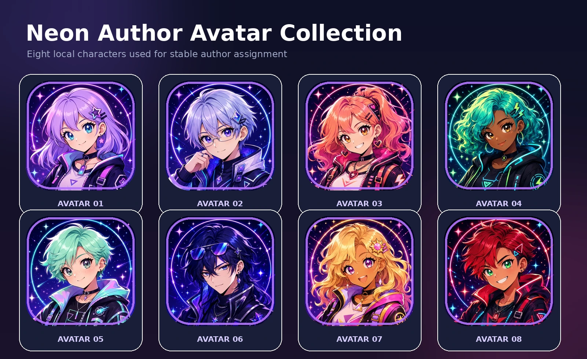
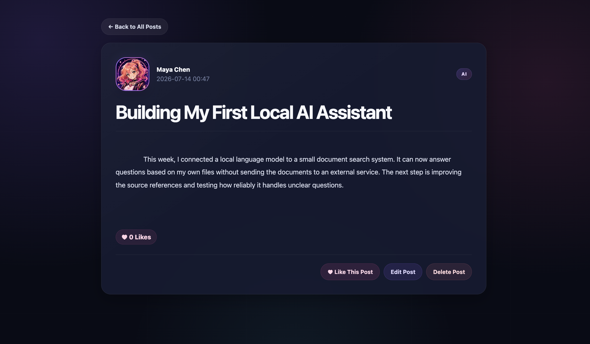

<p align="center">
    
</p>

<h1 align="center">Masterblog</h1>

<p align="center">
    A vibrant Flask community blog for sharing ideas,
    projects, and learning experiences.
</p>

<p align="center">
    <strong>Flask</strong> ·
    <strong>Jinja</strong> ·
    <strong>JSON</strong> ·
    <strong>HTML</strong> ·
    <strong>CSS</strong>
</p>

<p align="center">
    Search posts · Filter categories · Like stories ·
    Edit content · Explore author avatars
</p>

## Preview



## About the Project

Masterblog is a lightweight community blog built with Flask.

Users can create, edit, delete, search, filter, and like blog posts.
Each author is automatically assigned a locally stored neon anime avatar,
giving the application a colorful community identity without requiring
user accounts or external image services.

Blog posts are stored persistently in a JSON file.

## Features

- Create, update, and delete blog posts
- Search posts by title, author, content, or category
- Filter posts by category
- Persistent like counters
- Individual detail pages for every post
- Automatic local author avatars with initials as fallback
- Creation timestamps
- Responsive dark neon community design

## Automatic Author Avatars



Each author name is normalized and converted into a stable SHA-256 hash.
The resulting value determines which of the eight locally stored avatars
is displayed.

The same author name therefore always receives the same avatar.
If an image cannot be loaded, the author's initials are displayed as
a fallback.

## Post Detail View

The detail page presents the complete article together with its author,
creation date, category, like counter, and management actions.



## Installation

Clone the repository:

```bash
git clone https://github.com/DanielMS616/Masterblog.git
cd Masterblog
```

Create and activate a virtual environment:

```bash
python3 -m venv .venv
source .venv/bin/activate
```

Install the dependencies:

```bash
pip install -r requirements.txt
```

Start the application:

```bash
python3 app.py
```

Open the blog in your browser:

```text
http://localhost:4999
```

## Usage

From the home page, you can:

1. Create a new post with an author, title, category, and content.
2. Search existing posts by title, author, content, or category.
3. Filter the community feed by category.
4. Open a post's detail page with **Read More**.
5. Like, edit, or delete individual posts.

All changes are saved to `blog_posts.json`.

## Project Structure

```text
Masterblog/
├── app.py
├── blog_posts.json
├── requirements.txt
├── README.md
├── docs/
│   └── images/
│       ├── avatar-showcase.webp
│       ├── masterblog-banner.webp
│       ├── masterblog-detail.webp
│       └── masterblog-overview.webp
├── static/
│   ├── style.css
│   └── avatars/
│       ├── avatar-01.webp
│       ├── avatar-02.webp
│       ├── avatar-03.webp
│       ├── avatar-04.webp
│       ├── avatar-05.webp
│       ├── avatar-06.webp
│       ├── avatar-07.webp
│       └── avatar-08.webp
└── templates/
    ├── add.html
    ├── index.html
    ├── post.html
    └── update.html
```

## Technical Highlights

### JSON Persistence

Posts are loaded from and saved to a local JSON file. Changes remain
available after restarting the Flask application.

### Dynamic Routes

Flask routes use post IDs to open, update, like, or delete individual
posts.

### Stable Avatar Assignment

SHA-256 hashing converts each normalized author name into a stable avatar
index. The avatar calculation remains consistent between application
restarts.

### Initials Fallback

Author initials remain behind the avatar image. If the image file cannot
be loaded, the initials are displayed automatically.

### Jinja Templates

Jinja loops, conditions, filters, slicing, and fallback values are used
to render posts safely and dynamically.

### Responsive Design

The interface adapts to desktop and mobile layouts using CSS Grid,
Flexbox, media queries, reusable design variables, and accessible focus
states.

## Future Improvements

- User accounts and authentication
- Comments and threaded discussions
- Custom avatar selection
- Database storage with SQLAlchemy
- Form validation and flash messages
- Automated Flask tests
- Asynchronous likes without page reload
- Safer POST-based deletion with confirmation

## Author

Created by **Daniel Müller** as part of the Masterschool Software
Engineering program.
