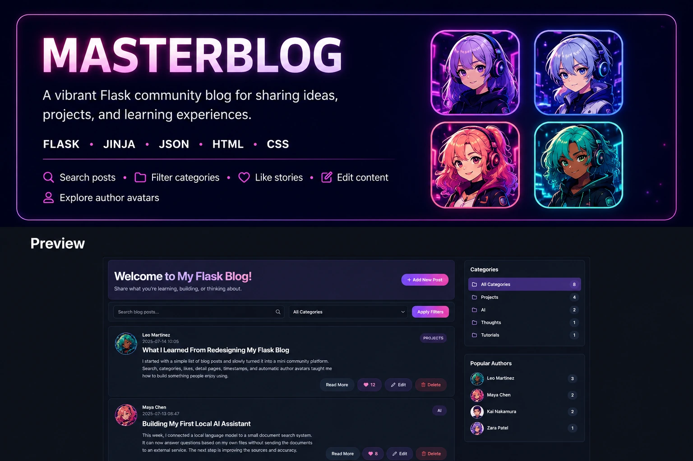
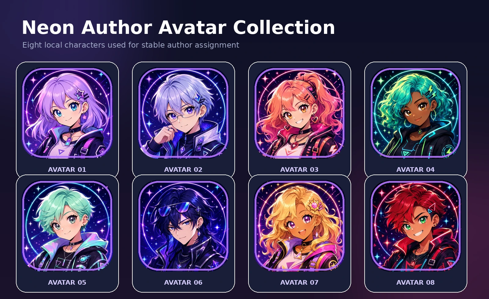

A Flask community blog for sharing ideas, projects, and learning experiences.

## About the Project

**Masterblog** is a lightweight community blog built with Flask.

Users can create, edit, delete, search, filter, and like blog posts.
Every post has its own detail page, category, creation timestamp, and
automatically assigned author avatar.

The application stores its data persistently in a local JSON file and
uses locally stored avatar images without relying on external image
services.

## Features

- Create, update, and delete blog posts
- Search by title, author, content, or category
- Filter posts by category
- Persistent like counters
- Individual detail pages for every post
- Automatic local author avatars
- Stable avatar assignment based on the author name
- Initials as a fallback when an avatar cannot be loaded
- Creation timestamps
- Responsive dark neon community design

## Automatic Author Avatars



Each author name is normalized and converted into a stable SHA-256 hash.
The resulting value determines which of the eight locally stored avatars
is displayed.

This means that the same author name always receives the same character,
even after restarting the application.

If an avatar image cannot be loaded, the author's initials remain visible
as a fallback.

## Post Detail View

Each post has an individual detail page containing its complete content,
author information, category, creation time, like counter, and management
actions.


## Tech Stack

- **Python** — application logic and data processing
- **Flask** — routing and web application framework
- **Jinja** — dynamic HTML templates
- **JSON** — persistent local post storage
- **HTML** — page structure
- **CSS** — responsive dark neon interface

## Installation

Clone the repository:

```bash
git clone https://github.com/DanielMS616/Masterblog.git
cd Masterblog
```

Create a virtual environment:

```bash
python3 -m venv .venv
```

Activate it on macOS or Linux:

```bash
source .venv/bin/activate
```

Activate it on Windows:

```powershell
.venv\Scripts\activate
```

Install the dependencies:

```bash
pip install -r requirements.txt
```

Start the Flask application:

```bash
python3 app.py
```

Open the application in your browser:

```text
http://localhost:5000
```

## Usage

From the home page, users can:

1. Create a post with an author, title, category, and content.
2. Search posts by title, author, content, or category.
3. Filter the community feed by category.
4. Open the complete article with **Read More**.
5. Like an individual post.
6. Edit or delete existing posts.

All changes are written to `blog_posts.json` and remain available after
restarting the application.

## Project Structure

```text
Masterblog/
├── app.py
├── blog_posts.json
├── requirements.txt
├── README.md
├── docs/
│   └── images/
│       ├── avatar-showcase.png
│       ├── masterblog-detail.png
│       └── masterblog-hero.png
├── static/
│   ├── style.css
│   └── avatars/
│       ├── avatar-01.webp
│       ├── avatar-02.webp
│       ├── avatar-03.webp
│       ├── avatar-04.webp
│       ├── avatar-05.webp
│       ├── avatar-06.webp
│       ├── avatar-07.webp
│       └── avatar-08.webp
└── templates/
    ├── add.html
    ├── index.html
    ├── post.html
    └── update.html
```

## Technical Highlights

### JSON Persistence

The application loads posts from `blog_posts.json` and saves the complete
updated list after creating, editing, deleting, or liking a post.

### Dynamic Routes

Flask uses dynamic post IDs for detail pages and post-specific actions:

```text
/post/<post_id>
/update/<post_id>
/delete/<post_id>
/like/<post_id>
```

### Stable Avatar Assignment

The normalized author name is converted into a SHA-256 hash. Part of that
hash is used to calculate a stable index for the local avatar list.

### Jinja Templates

Jinja loops, conditions, filters, slicing, and fallback values are used
to render the stored data dynamically.

### Responsive Interface

CSS Grid, Flexbox, media queries, reusable variables, hover effects, and
accessible focus states create a responsive interface for desktop and
mobile screens.

## Future Improvements

- User accounts and authentication
- Author profiles and manual avatar selection
- Comments and threaded discussions
- Database storage with SQLAlchemy
- Form validation and flash messages
- Automated Flask tests
- Likes without reloading the page
- POST-based deletion with confirmation
- Pagination for larger communities

## Author

Created as part of the Masterschool Software Engineering program.